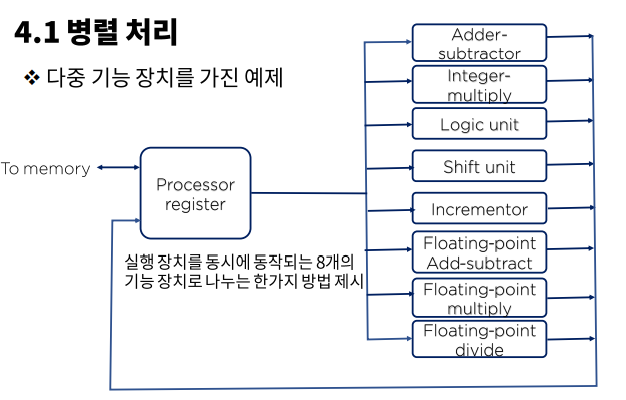

# 데이터의 종속성 - 병렬처리 그리고 파이프라인

### 병렬 처리

병렬처리(parallel processing)는 컴퓨터 시스템의 계산 속도 향상을 목적으로 하여 동시 데이터 처리기능을 제공하는 광범위한 개념의 기술을 의미한다.

- 복잡도에 따른 병렬처리의 다양한 단계
  - 사용 레지스터의 형태에 따른 병렬 성 구현(ex, 시프트 레지스터)
  - 동일한 또는 서로 다른 동작을 동시에 수행하는 여러 개의 기능 장치(function unit)를 가지고서 데이터를 각각의 장치에 분산 시켜 작업을 수행하는 경우

### 파이프 라인

- 파이프라인 구조의 성능

파이프라인의 동작은 공간 시간표에 의해 설명 되는데, 이것은 시간에 대한 함수로서 세그먼트의 사용상황을 보여준다.

