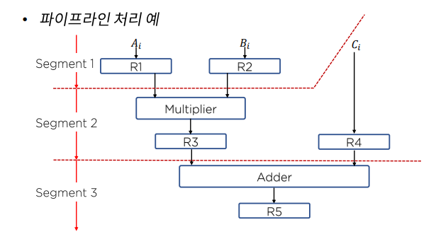
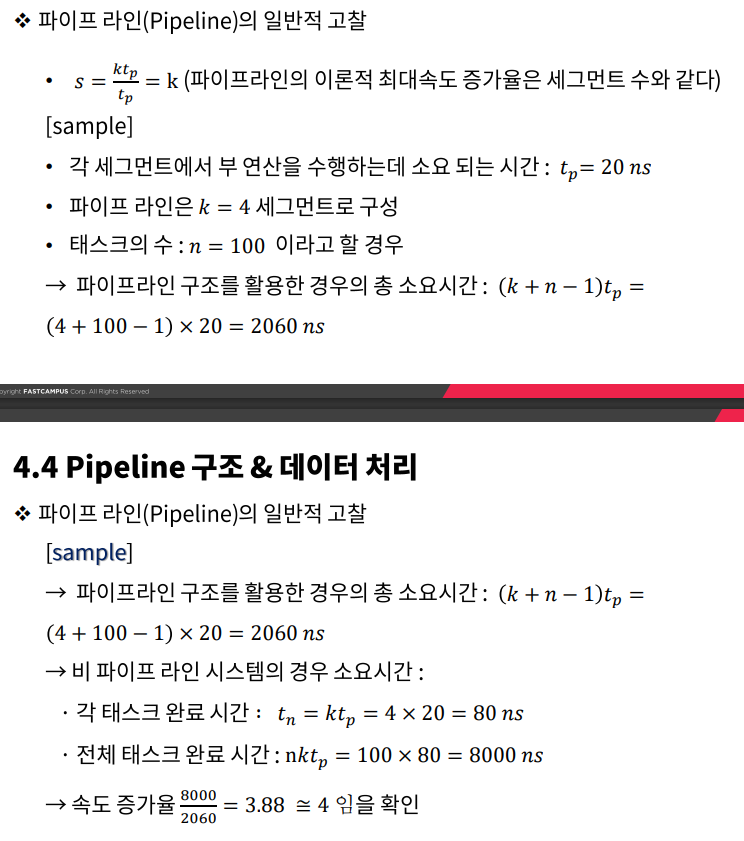

# Pipeline 구조 - 데이터/구조

### Pipeline 구조 & 구현

- 하나의 프로세스를 서로 다른 기능을 가진 여러 개의 서브프로세스로 나누어 각 프로세스가 동시에 서로 다른 데이터를 취급하도록 하는 기법
- 각 세그먼트에서 수행된 연산 결과는 다음 세그먼트로 연속적으로 넘어가게 되어 데이터가 마지막 세그먼트를 통과하게 되면 최종적인 연산 결과를 얻게 된다 - 하나의 프로세스를 다양한 연산으로 중복시킬 수 있는 근간은 각 세그먼트마다의 레지스터이다.

- 간단한 파이프 라인 구현 예제 - 곱셈과 덧셈이 섞여 있는 다항식 연산

### 파이프라인의 일반적 고찰

- 동일한 복잡도의 부연산들로 나뉘어지는 어떠한 연산 동작도 파이프라인 프로세서에 의해 구현될 수 있다.
- 파이프라인 기술은 매번 다른 데이터 집합을 동일한 태스크에 적용시켜 여러 번 반복하는 응용에 효과적이다.

