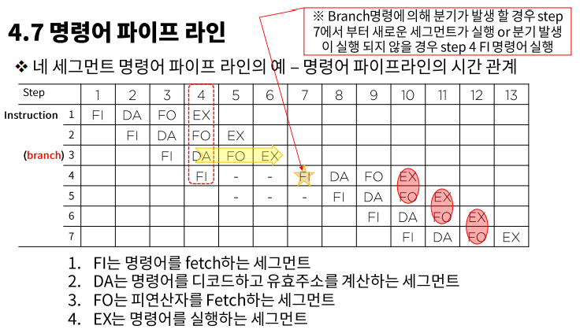

# Pipeline 구조 - 산술 & 명령어 파이프 라인

### 현실적 파이프라인 구조

#### 파이프라인 구조 vs 병렬적인 다중 기능 장치

- 실제 파이프라인 구조가 이론적인 최대 속도를 구현하지 못하는 이유
  - 각 세그먼트 들이 부연산을 수행하는 시간이 서로 다르다.
  - 또한 각 레지스터를 제어하는 클럭 사이클은 최대 전파시간을 갖는 세그먼트의 지연시간과 싱크를 맞추어야 한다.
- 다음 그림과 같이 병렬적인 다중 기능장치를 고려할 수 있다.
  - 각 P회로는 전체 파이프라인 회로에서와 동일하게 태스크를 수행한다.

> 그러나 이 구조는 순차적 처리가 아니라 모든 회로가 동시에 데이터를 입력 받아 네 태스크를 한꺼번에 수행한다 - SIMD 구조 일 뿐

- 파이프라인 구조 > 순차적 처리 구조

#### 파이프 라인 구조가 적용되는 컴퓨터 설계

- 산술파이프 라인 : 산술 연산들을 부연산으로 나누어 파이프 라인의 세그먼트에서 수행
- 명령어파이프 라인 : 명령어 사이클의 fetch, 디 코드, 실행단계를 중첩 시킴으로 명령어 흐름에 동작

