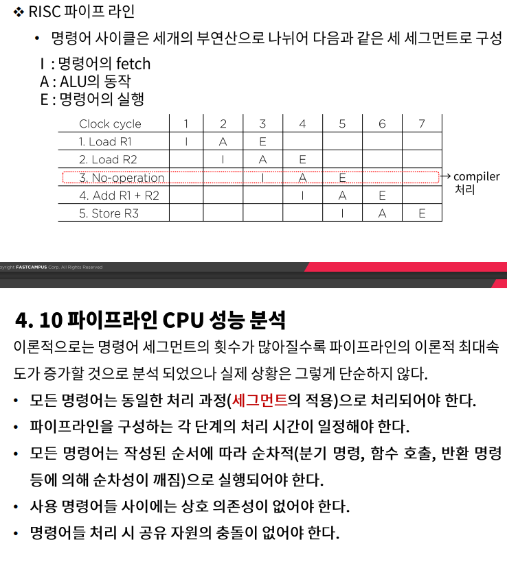

# 파이프라인과 벡터처리 - 파이프라인 CPU의 성능 분석

### 파이프라인 분기 예측

- 명령어 파이프라인이 정상적인 동작에서 벗어나게 되는 요인

  - 자원 충돌 : 두 세그먼트가 동시에 메모리를 접근하려고 하는 데에서 기인한다

    명령어 메모리와 데이터 메모리를 분리함으로써 대부분 해결

  - 데이터 의존성 : 충돌은 어떤 명령어가 이전 명령어의 결과에 의존하여 수행되는데, 그 값이 아직 준비되지 않은 경우에 발생한다.

  - 분기 곤란 : 분기 명령어 같이 PC의 값을 변경 시키려는 명령어에 의해 발생한다.

- 데이터 의존성

  - 데이터나 주소의 충돌은 명령어 파이프라인의 성능을 저하 시키는 요인
    - 데이터 의존성 : 아직 준비되지 않은 데이터를 기다리는 경우
    - 주소 의존성 : 마이크로 연산 시 레지스터 간접모드를 사용하는 명령어는 이전 명령어가 주소 값을 메모리로 부터 로드하는 명령어라면 곧바로 피연산자를 fetch하지 못하고 기다리게 된다.

- 데이터 의존성 해결 방법

  - 하드웨어 인터락 : 어떤 명령어의 피 연산자가 파이프라인에서 앞서간 명령어의 목적지와 일치하는지를 검사하는 회로 -> 이러한 상황이 감지되면 피연산자가 준비되지 않은 명령어는 충돌을 피할 수 있을 만큼 충분한 클런 사이클을 두어 지연시킨다.
  - 오퍼랜드 포워딩 : 충돌을 감지하는 경우 특별한 통로를 통해 직접 파이프라인 세그먼트에 전달하는 경우

### 분기 명령어의 처리

- 조건 분기 또는 무조건 분기 등은 처리 여하에 따라 파이프라인의 정상적인 프로그램 순서를 바꾸어 버리기 때문에 파이프라인 시스템을 채택하고 있는 컴퓨터의 성능을 저하시키는 주요인으로 간주 되고 있다.
  - 순차적으로 처리될 명령어를 분기의 목표가 되는 명령어와 함께 저장하는 방법
  - 분기 목표 버퍼(branch targe buffer)의 사용 : fetch 세그먼트에 속해 있는 associative memory  : 이전에 실행된 분기 명령어와 분기 목표 명령어를 저장하여 활용

- 분기 예측
  - 실제 다양한 프로그램의 실행 결과를 분석한 결과 참조의 시간적 지역성과 유사하게 일부 명령어들은 반복 수행되며 반복 실행시에는 규칙성을 갖는다
  - 이러한 예측 기법을 이용하여 분기 및 적재 명령어가 참조하는 오퍼랜드도 반복 참조 시 규칙성을 갖고 있으며 이를 이용할 경우 명령어 fetch과정에서 신속하게 오퍼랜드의 제공 및 fetch가 수월해 질 수 있다 다만 예측실패시 지불해야할 패널티가 있을 수 있다.

### RISC Processor

- RISC 프로세서의 설계목표
  - 실행 명령어 수는 증가 하더라도 작업 처리 시간의 감소가 가능하다.
  - 명령어당 실행 클록 수(CPI)와 클록 주기를 파이프라인 구조를 이용하여 감소시킬 수 있따.
- RISC프로세서의 구조적 특징
  - 명령어의 1 사이클 실행을 위한 파이프라인 구조, 메모리 참조를 위한 온칩 캐쉬
  - 간단 명령 코드와 주소 지정 모드 및 하드와이어 적 제어 장치
  - 신속한 오퍼랜드 참조/문맥 전환을 위한 레지스터 집합
  - 실수 연산의 별도 처리를 위한 코프로세서

