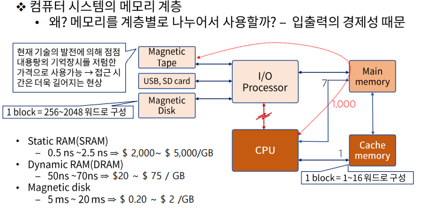
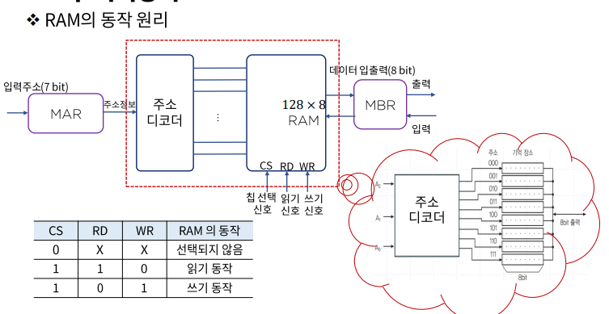

# 메모리 구조 - Memory system의 이해

### 메모리 계층

기억장치는 CPU에 의하여 시행될 프로그램이 저장되는 곳으로 이는 주 기억 장치와 보조기억장치 그리고 캐쉬 메모리로 분류 된다.

- 주 기억장치
  - 마더보드에 장착됨 -RAM(Random Access Memory)
    - 비교적 대용량, 고속의 속도를 지님, 휘발성 성질을 지님
  - ROM(Read Only Memory)도 주 기억장치의 일종
- 캐쉬 메모리
  - 주기억장치 접근 시간 > 프로세스 논리회로 => MMS & CPU 배치함
  - 현재 진행되고 있는 프로그램의 일부 또는 사용빈도가 높은 임시 데이터 저장

- 보조 기억장치
  - 비교적 저속, 대용량의 자료 보관이 가능하다
  - 보조기억장치내 자료는 필요한 경우 주 기억 장치로 옮겨져야 한다.
  - Magnetic Tape, USB, SD card - 필요한 파일의 생성 및 삭제가 가능
  - Magnetic drum, disk - back up 저장 장치
  - 코어 메모리, magnetic bubble, CCD(Charge coupled device)등의 대용량 저장 장치

주 기억장치

- RAM
  - SRAM(static RAM)
    - 전원이 연결되어 있는 동안 정보 유지(Flip-Flop으로 구성)
    - 사용이 편리하고, 읽기와 쓰기 시간이 짧다(cache 기억장치)
  - DRAM(Dynamic RAM)
    - 주기적으로 재충전 해 주어야 정보가 유지
    - 전력 소비가 적고, 하나의 칩으로 대량의 정보를 저장할 수 있다.
- ROM
  - 부트 스트랩 로더
  - 전원의 on/off와 무관하게 작동 되기 때문에 불변하는 상수의 표 등이 저장

보조기억장치의 주요 특성

- 접근 시간 : 메모리내의 기억장소에 도달하여 그 내용을 얻는데 요구되는 평균 시간을 의미한다.
  - 시크타임 : read/write head가 지정된 기억장소에 도달하는데 소요 되는 시간
  - 트랜스퍼 타임 : 추출된 데이터를 장치내 또는 장치 밖 필요한 곳으로 전송하는데 요구되는 시간
  - 레코드 : 일반적으로 데이터가 기록되는 단위, 시크 타임을 체크하게 되는 기준
  - 전송률 : 장치가 레코드의 시작점에 위치한 다음 단위 시간 당 전송 할 수 있는 문자나 위드의 수