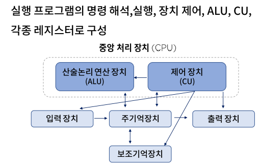
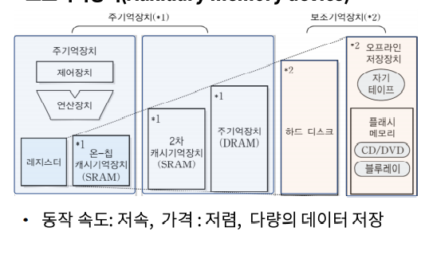
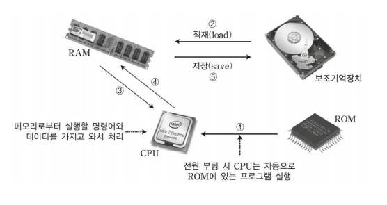

# 컴퓨터 구소요소의 기능 및 이해

### 컴퓨터 구성요소의 인지와 기능의 조합

- 중앙 처리 장치(Central Processing Unit)
  - CPU/MPU
  - 사물 인터넷 디바이스 H/W플랫폼 종류
- 주변장치(Peripheral Device)
  - 기억장치(Memory unit)
  - 보조기억장치
  - 입.출력 장치

### 중앙 처리 장치

#### CPU

- 마더 보드

  데이터의 전달 통로가 디자인 되어있는 메인 보드

  

#### MPU

- CPU를 LSI(고밀도 집적회로)화 한 일종의 통합 장치
- CISC(Complex Instruction Set Computer)
- RISC(Reduced Instruction Set Computer)
- Bit Slice MPU등이 존재 한다.

#### 사물 인터넷 디바이스 H/W플랫폼 종류

- 아두이노, 라즈베리 파이, 갈리레오, 에디슨

### 주변장치

- 기억장치
  - RAM(Random Access Memory)
    - DRAM(Dynamic RAM)
    - SRAM(Static RAM)
  - ROM(Read Only Memory)

- 보조기억장치

- 주 기억장치와 보조기억장치의 관계

  

- 최근 부각되는 보조 기억장치
  - 플래시 기억장치
    - SF
    - SSD
  - USB 기억장치
  - SD card
  - 메모리 스틱

- 디스크의 성능과 파라미터
  1. 탐색 시간, 회전 지연, 데이터 전송 시간
- 디스크 접근 시간 = 탐색시간 + 회전 지연 + 데이터 전송 시간

- 주변장치
  - 키보드, 마우스, 스캐너, 터치 스크린, 바코드 판독기