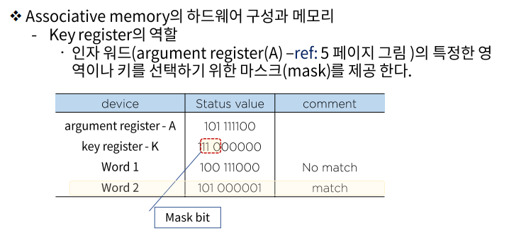

# 메모리 구조 - 효율적 메모리 관리 정책

### Associative 메모리

Associative memory란?

- 내용에 의해 접근하는 메모리 장치를 이르는 용어이다.
  - 메모리장치란 자료의 저장과 접근을 용이하게 하기위해 필요로 하는 장치
  - 결국 이상의 필요에 따라 CPU는 필요한 자료를 얻기 위해 메모리 장치에 탐색을 하게 될 수 밖에 없고
  - 좀 더 효율적 탐색이 가능 할 수 있는 저장 공간의 필요에 의해 만들어진 저장 형태를 우리는 이렇게 명명 (content addressable memory, CAM)
- 이 방식은 데이터의 내용으로 병렬 탐색을 하기에 적합하도록 구성되어 있으며, 탐색은 전체 워드 또는 한 워드 내의 일부만을 가지고 실행 될 수 있다.

- associative memory는 각 셀이 저장 능력 뿐 아니라 외부의 인자와 내용을 비교하기 위한 논리회로를 갖고 있기 때문에 RAM보다 값이 비싸다.
  따라서 탐색시간이 필히 짧아야 하고 그 것이 이슈일 경우 활용된다.

### 참조의 국한성

- 프로그램이 수행되는 동안 메모리 참조는 국한된 영역에서만 이루어지는 경향이 있음을 확인 할 수 있다.
  - 프로그램 루프와 서브루틴의 빈번한 활용
  - 순차적 프로그램의 실행
  - 데이터 메모리 참조에서도 동일한 경향이 있음을 확인 할 수 있따.
    - 테이블 룩업 절차
    - 공통 메모리와 배열 사용 예
- 캐시 메모리
  - 이와 같이 참조의 국한성을 이용하여 속도는 빠르고(거의 CPU처리속도와 동일), 조그마한 메모리(고 비용이기 때문에)를 이용하여 프로그램을 수행 시킬 경우 평균 메모리 접근 시간의 단축과 그에 따른 전체 프로그램 수행 시간의 절약을 담보 할 수 있을 것이다. 이러한 기억 공간을 우리는 캐쉬메모리라 한다.

### Cache 메모리

- Cache메모리의 동작과 성능
  - Cache의 기본 동작(CPU가 메모리에 접근 할 필요가 있을 경우)
    - Cache를 체크
    - 워드가 Cache에서 발견되면(hit) 읽어 들이고 아닐 경우 (miss) 주 기억장치에 접근 한다.
    - 이 워드를 포함할 블록(1 - 16 워드, 환경에 따라 다름)을 cache로 전송한다.
  - 힛트 율(hit ratio)
    - 힛트 수/CPU에 의한 메모리 참조 총 수

- Cache 메모리의 매핑 프로세스
  - 효율적 메모리 관리를 위해서는 효과적으로 cache를 구성하는 방법이 현존하는 메모리 관리 방법 중 최고의 방법임은 이론의 여지가 없다.
  - 이에는 다음과 같은 방법들이 존재
    - associative mapping
    - direct mapping
    - set-associative mapping

