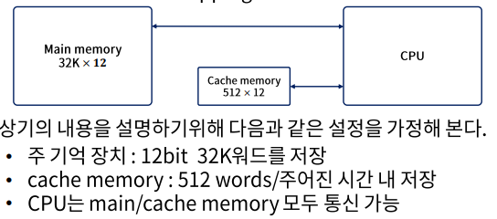
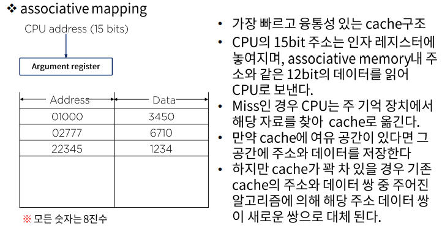
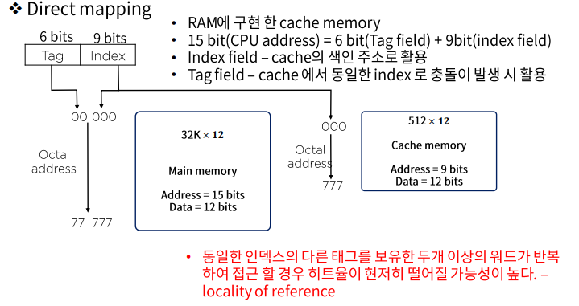
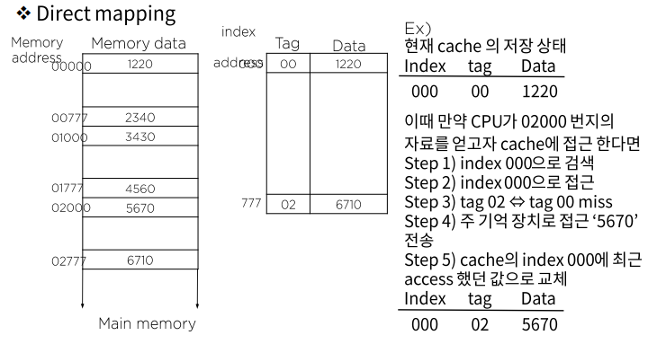
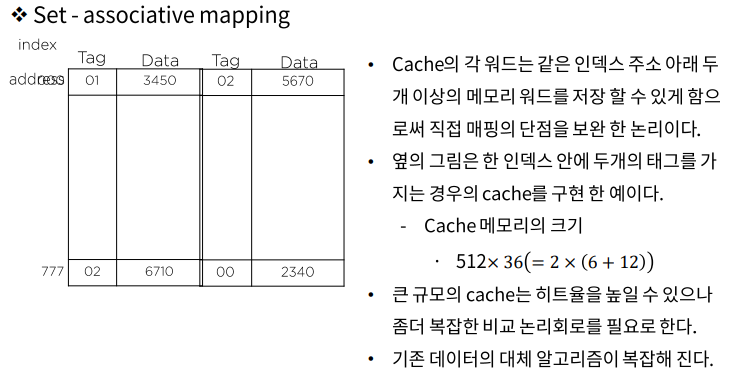
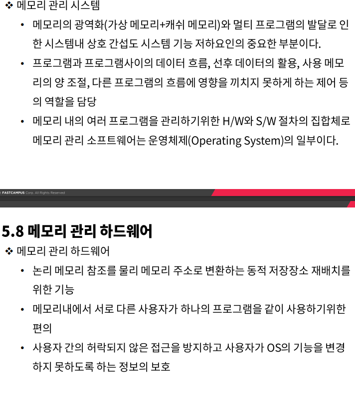

#  컴퓨터 성능 개선을 위한 메모리 관리

### Cache 메모리의 매핑 프로세스

- Associative mapping
- Direct mapping
- Set-associative mapping

- 우선 15bit의 주소를 cache로 보내어 hit가 발생하면 cache로 부터 12bit의 데이터를 받아 들인다.

- 만약 miss가 발생하면 주기억장치로부터 워드를 읽고, 이를 cache로 이동 저장한다.

- 다중 캐쉬
  - CPU와 메인 메모리 사이에 위치하는 프라이머리 캐쉬
    - 작지만 매우 빠르다
  - Level-2캐쉬
    - 프라이머리 캐쉬 보다는 크지만 여전히 D-RAM보다는 현저히 빠른 속도
  - L-3캐쉬

### 가상 메모리

설치 위치 - 보조기억 장치와 주기억장치 사이에서 데이터 전송을 관리

필요성 - 전체 메모리 시스템의 총 경비를 최소화 하면서 가능한 메모리로의 높은 평균 접근 속도를 위해서 활용 되고 있음

사용 목적 - CPU에 의해 현재 사용되고 있지 않은 자료 및 프로그램ㅇ르 보관

활용방안 - 페이지를 사용하는 주소 매핑, Asoociative메모리 페이지표, 페이지 교체

