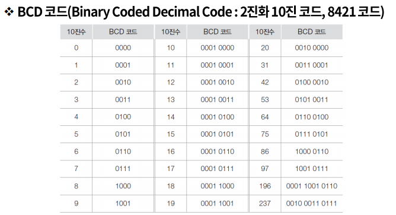

# 데이터의 표현 - 데이터의 종류

### 컴퓨터에서의 데이터 표현

- 진법과 진법 변환

  - 보수(Complement)

    최대값(해당 bit에서 가장 큰 표현형)을 형성하는데 서로 보완 관계에 있는 두 수 사이의 관계를 one's COMPLEMENT 라고 한다.

    MODULUS(최대 표현 자리 수)를 형성하는데 서로 보완관계에 있는 두 수 사이의 관계를

    two's COMPLEMENT라한다.

    > ex)10진수에서의 보수
    >
    > 1진 보수 A+B = 9 A+B=99
    >
    > 2진 보수 A+B=10 A+B=100

    > ex) 2진수 보수
    >
    > 1진 보수 A+B=1 A+B=11 A+B=111
    >
    > 2진 보수 A+B=10 A+B=100 A+B=1000

  2진수의 1의 보수는 자신의 수를 반대로 바꾸면 되고, 

  2의 보수는 1의보수에 +1 또는 

  주어진 수의 우단으로부터 최초의 유효 BIT까지는 그대로 두고 나머지를 모두 반대로 바꾸면 된다.

- 정수 표현

  1. sign bit 0 + 1 -

     표현범위 n bit 사용 -(2^(n-1)-1) <=N <= +(2^(n-1)-1)

  2. 10진수형 정수 표현
     - packed decimal
     - 1 byte에 2자의 10진수를 표현 (BCD code)
     - 마지막 4개의 비트로는 부호를 표현

- 실수 표현

  - 부동 소수점

  - 부호 비트 | 지수 필드 | 기수 필드

    0 | 0000101 | 1001 0000 0000 0000 0000 -> +0.1001 * 2&5

- 디지털 코드
  - 3초과 코드
- 에러 검출 코드
  - 패리티 비트
  - 해밍 비트
    - 8비트 데이터의 에러 정정 코드 (어느 부분에 에러 코드가 있는지 찾을 수 있음)