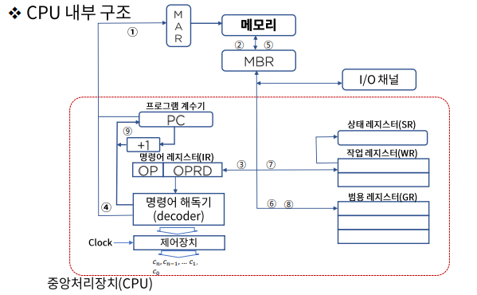
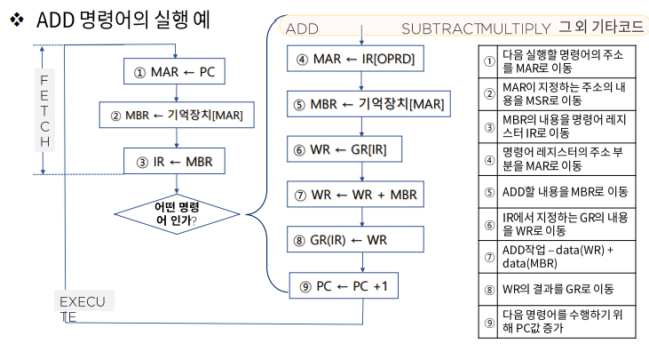

# 중앙처리장치 - CPU 내부 구조와 레지스터

### CPU 구성요소

컴퓨터에서 데이터 처리동작을 수행하는 부분을 **중앙 처리 장치**라고 하며 줄여서 

CPU(Central Processing Unit)라고 부른다. 
CPU는 레지스터 세트(Register set):RS간 정보전송 감시, ALU에게 수행할 동작을 지시
산술논리장치(ALU):명령어를 실행하기위한 마이크로 연산 수행
제어장치(Control Unit):명령어를 실행하는 필요한 데이터를 보관
로 구성된다.

> MAR 메모리 상태를 나타내주는 레지스터

### 각종 레지스터들의 명칭과 기능

- 프로그램 계수기(Program counter)

  - 다음에 수행될 명령어가 들어있는 주기억장치의 주소를 기억하고 있는 레지스터로 IC(instruction counter) 혹은 LC(location counter) 라고도 부른다.

- 명령 레지스터(Instruction Register)

  - IR이라고도 하며, 프로그램 계수기(PC)가 지정하는 주소에 기억되어 있는 명령어를 해독하기 위해 임시 기억하는 레지스터

- 명령어 해동기(instruction decoder)

  - IR에 들어있는 명령코드의 해석을 담당하는 회로

- 제어장치(control unit)

  - ID로부터 보내져온 신호에 따라 명령어를 실행(clock에 의해 발생)

- 범용 레지스터(general purpose register)

  - 작업 레지스터에서 DATA가 용이하게 처리되도록 임시로 자료를 저장하는 경우 사용

- 작업 레지스터(working register)

  - 산술논리연산을 실행할 수 있도록 자료를 저장하고 그 결과를 저장

    (GPR과의 차이점은 ALU에 연결 되어있나의 차이점)

- 상태 레지스터(status register)

  - CPU의 상태를 나타내는 특수목적의 레지스터 - 연산결과의 상태, 영Z, 부호S, 오버플로우V, 캐리C, 인터럽트 I

